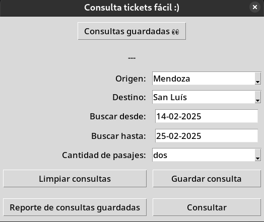
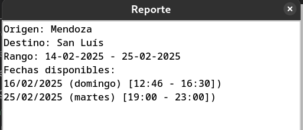
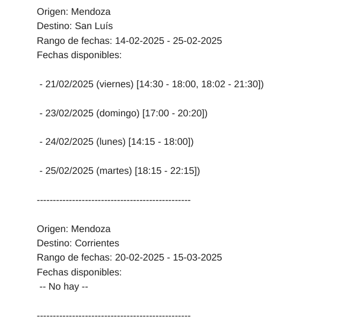

# Ticket Checker

## A little tool for personal use that simplifies the consultation of available bus tickets with CUD (Unique Disability Certificate)

### Features

- Checks ticket availability for a given route and date range
- Sends email notifications when tickets become available
- Uses a GUI interface for user input

### Requirements

- Python 3.12
- Tkinter for GUI interface

### Setup

1. If Python is not installed on your system, you can install it from [here](https://www.python.org/downloads/).

2. If tkinter is not included with your Python installation, install it as follows:

   Debian/Ubuntu-based distributions:

   ```bash
   sudo apt install python3-tk
   ```

3. Clone the repository:

   ```bash
   git clone https://github.com/MauricioGiana/ticket_alert.git
   ```

4. Setup a Python virtual environment (optional):

   ```bash
   python -m venv venv
   ```

   macOS/Linux:

   ```bash
   source venv/bin/activate
   ```

   Windows:

   ```bash
   .\venv\Scripts\activate
   ```

   When you're done working, deactivate it:

   ```bash
   deactivate
   ```

5. Install the required packages:

   ```
   pip install -r requirements.txt
   ```

### Usage

#### GUI interface

- Run the application:

  ```
  make start
  ```

- Enter the origin, destination, date range, and quantity in the GUI interface:

  

- Options:

  - `Consultar`: Directly get the result of current consult.
  - `Guardar consulta`: Save the current consult by adding it to a persisted list (click
    button `Consultas guardadas` to see the list).
  - `Reporte de consultas guardadas`: Make all the saved consults.
  - `Limpiar consultas`: Delete all saved consults.

- Result example:

  

#### Terminal interface

- Start the command interface:

  ```
  make start-terminal
  ```

- Select what to do:

  ```
  Que desea hacer?
  » Nueva consulta
    Enviar reporte de consultas guardadas
    Ver consultas guardadas
    Limpiar consultas guardadas
    Salir
  ```

  - If you select `Nueva consulta`:

    - You will be prompted to enter the travel data.
    - Then, you can either directly send the report or save it.

    ```
       Cómo continuar?
       » Enviar reporte
         Agregar otra consulta
         Guardar consulta
         Volver
    ```

  - The result will be sent to the email set in `RECIPIENT_EMAIL` environment variable:

  

#### Troubleshooting

- Check the console output for any error messages
- Make sure the email account credentials are correct
- Make sure the email recipient address is correct

License:
This project is licensed under the MIT License.
